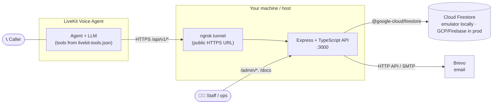
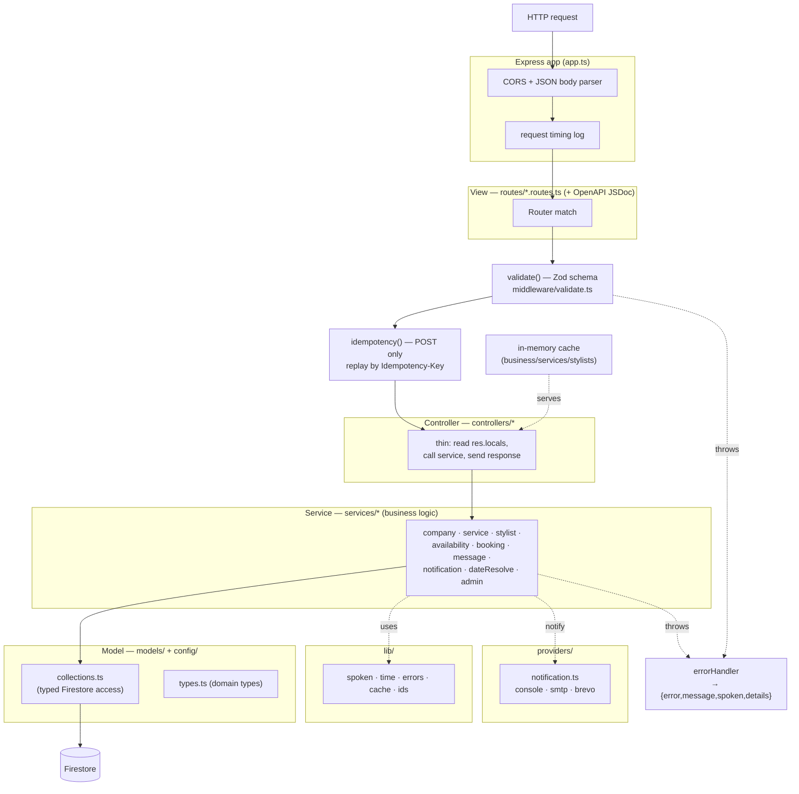
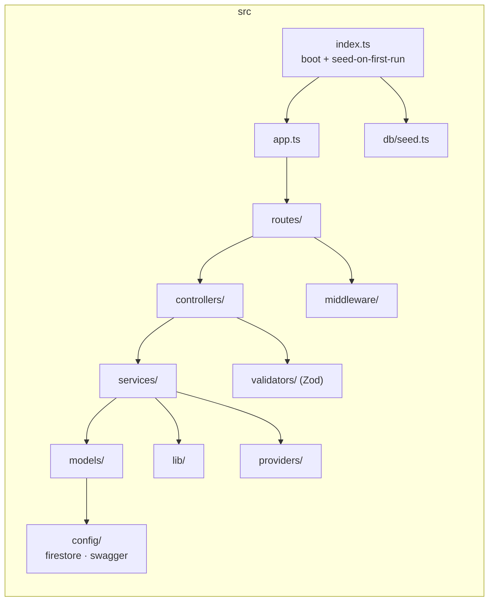
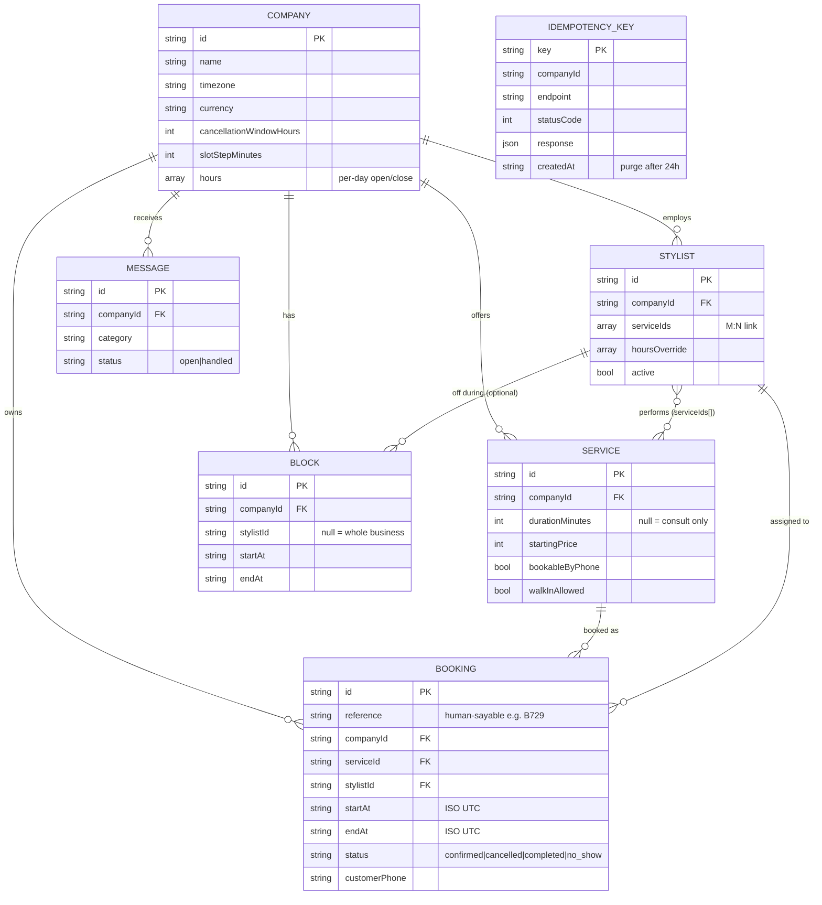
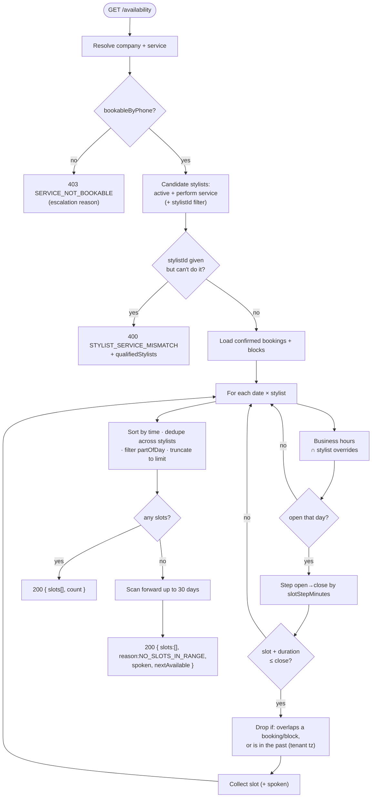
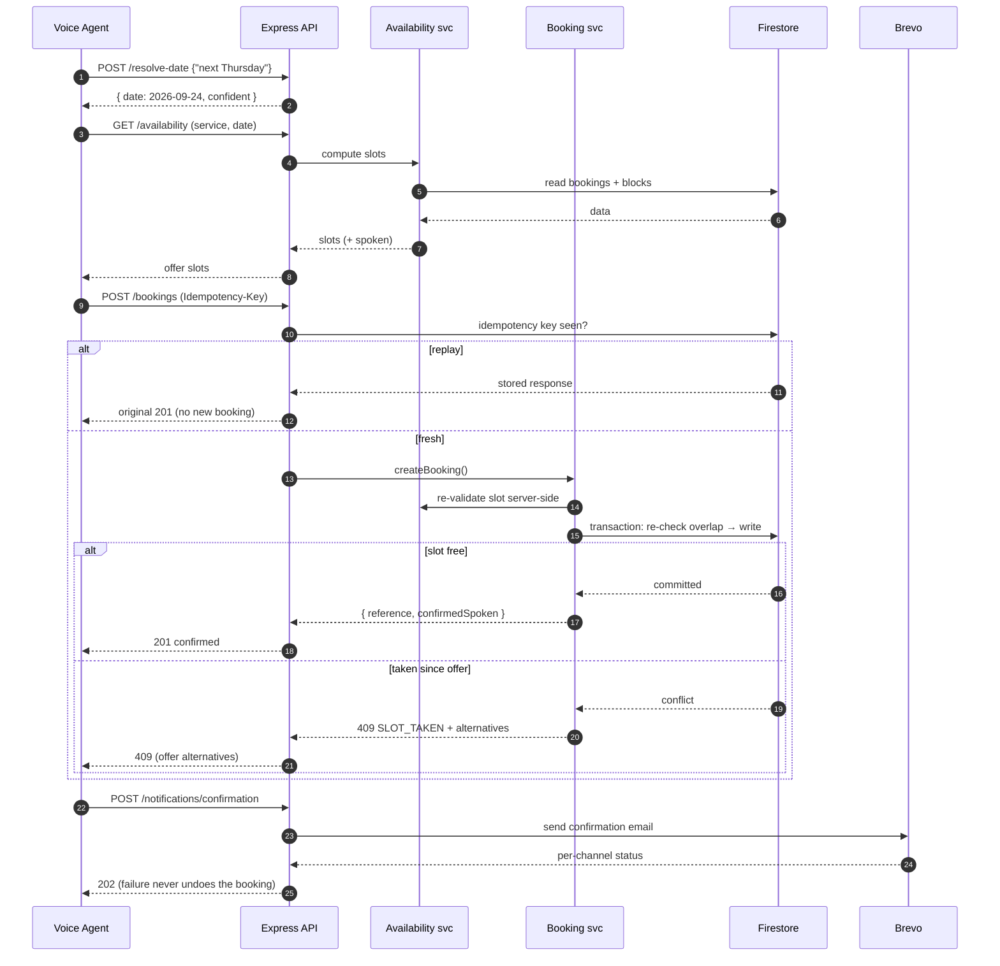
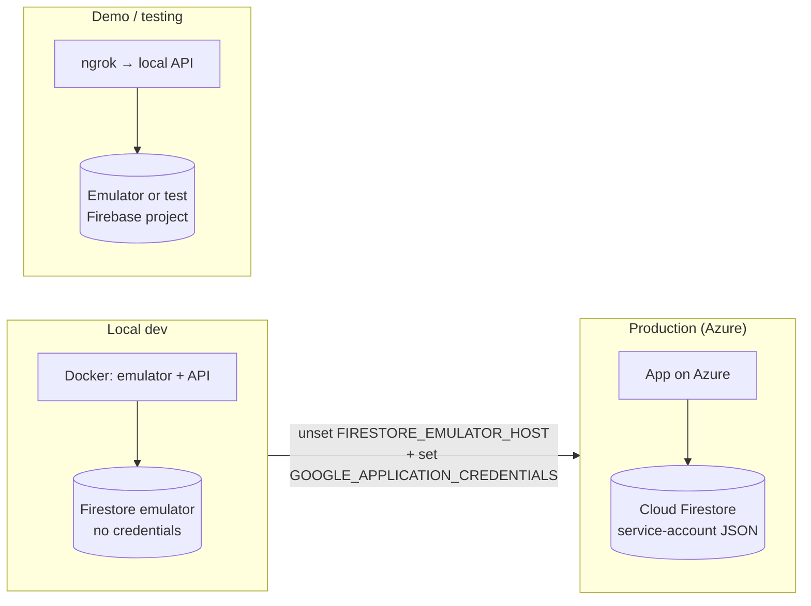

# Architecture

System design for the Salon Voice-Agent Booking API. All diagrams are
[Mermaid](https://mermaid.js.org) — they render on GitHub and in most Markdown
viewers/IDEs.

- [1. System context](#1-system-context)
- [2. Layered architecture & request pipeline](#2-layered-architecture--request-pipeline)
- [3. Module / directory map](#3-module--directory-map)
- [4. Data model](#4-data-model)
- [5. Availability engine](#5-availability-engine)
- [6. Booking sequence (end to end)](#6-booking-sequence-end-to-end)
- [7. Environments](#7-environments)

---

## 1. System context

Who talks to the API and what it depends on. The API is stateless; all state
lives in Firestore. Notifications go out through a pluggable provider.

---

## 2. Layered architecture & request pipeline

MVC + service layering. Every request flows top-to-bottom; errors thrown anywhere
are caught by the error middleware and rendered as `{ error, message, spoken, details }`.

**Key rules baked into the pipeline**

- Every request is scoped by `companyId`; no endpoint crosses tenants.
- Every agent-facing value ships with a `*Spoken` twin (via `lib/spoken.ts`).
- POSTs are idempotent (replay-safe) via the `Idempotency-Key` header.
- Reads for `/business`, `/services`, `/stylists` are served from an in-memory
  cache, invalidated on admin writes.

---

## 3. Module / directory map

---

## 4. Data model

Firestore is document-oriented; the relational spec is mapped to top-level
collections. The stylist↔service many-to-many is denormalised onto each stylist
as a `serviceIds[]` array for single-read lookups.

---

## 5. Availability engine

The core computation (`services/availability.service.ts`). Empty is a `200` with
a `nextAvailable` counter-offer, never an error.

---

## 6. Booking sequence (end to end)

The happy path an agent walks, including idempotency and the write-time
transaction that prevents double-booking.

---

## 7. Environments

Same code, three wirings — only environment variables change.

> Selection logic lives in `src/config/firestore.ts`: if `FIRESTORE_EMULATOR_HOST`
> is set it uses the emulator (no auth); otherwise it uses `GOOGLE_CLOUD_PROJECT`
> + the service-account key. See `README.md` for the exact variables.
